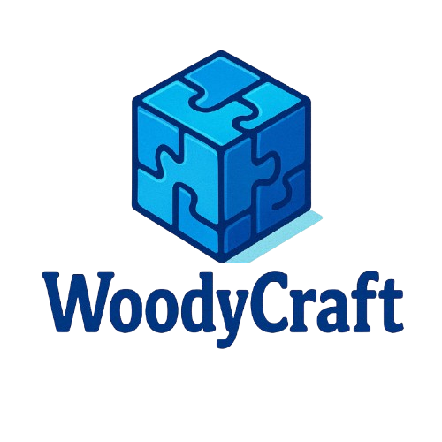

<p align="center">
  <a href="https://github.com/ludo-mastant/WoodyCraftWeb" target="_blank">
    
  </a>
</p>


## À propos de WoodyCraftWeb

**WoodyCraftWeb** est une boutique en ligne spécialisée dans les **puzzles 3D en bois**. Nos produits sont conçus pour offrir un **moment créatif, amusant et relaxant** pour tous les âges.  

### Caractéristiques principales

- Puzzles 3D de haute qualité et faciles à assembler.  
- Designs uniques inspirés de la nature, des animaux et des monuments célèbres.  
- Instructions détaillées et illustrations incluses.  
- Livraison rapide et service client dédié.  
- Options de paiement sécurisées.

## Catalogue

Nous proposons une large gamme de puzzles 3D :  

- Animaux : lions, éléphants, oiseaux…  
- Véhicules : voitures anciennes, avions, bateaux.  
- Monuments : tours célèbres, ponts, châteaux.  
- Personnalisables : certains modèles peuvent être gravés ou peints à votre goût.  

Chaque puzzle est livré avec une image et un guide de montage pour faciliter l’expérience.

## 1 Installation / Lancement du projet

### 1.1 Clonez le projet :  
```bash
git clone https://github.com/ton-username/WoodyCraftWeb.git
```

### 1.2 Installez les dépendances :
```bash
composer install
npm install
npm run dev
```
Configurez votre fichier ***.env*** avec vos informations de ***base de données*** et ***clés API***.

### 1.3 Lancez le serveur :
```bash
php artisan serve
```
Contribuer

Vous souhaitez contribuer au développement de **WoodyCraftWeb** ? Nous acceptons les **suggestions**, les idées de nouveaux puzzles ou les **améliorations** du site. pour plus d’informations venez en privé.
.
## Licence

WoodyCraftWeb est open-source et distribué sous ***licence MIT***.